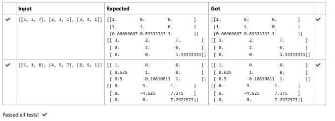
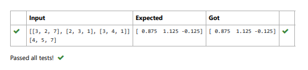

# LU Decomposition without zero on the diagonal

## AIM:
To write a program to find the LU Decomposition of a matrix.

## Equipments Required:
1. Hardware – PCs
2. Anaconda – Python 3.7 Installation / Moodle-Code Runner

## Algorithm
### Step 1:
Read the elements of augmented matrix into arrays a and b.
### Step 2:
Calculate elements of L and U.
### Step 3:
Print elements of L and U.
### Step 4:
Find V by solving LV = B by forward substitution.
### Step 5:
Find X by solving UX = V by backward substitution.
### Step 6:
Print Array X as the solution.
### Step 7:
End of the program.

### Program  
## Program 1:
```
import scipy from 
scipy.linalg import lu 
a=eval(input()) 
p,l,u=lu(a) 
print(l) 
print(u) 
```
## Program 2:
```
import numpy as np 
from scipy.linalg import lu_factor,lu_solve 
a=eval(input()) 
b=eval(input()) 
lu,piv=lu_factor(a) 
x=lu_solve((lu,piv),b) 
print(x)
```
## Output:
### Output 1:

### Output 2



## Result:
Thus the program to find the LU Decomposition of a matrix is written and verified using python programming.

